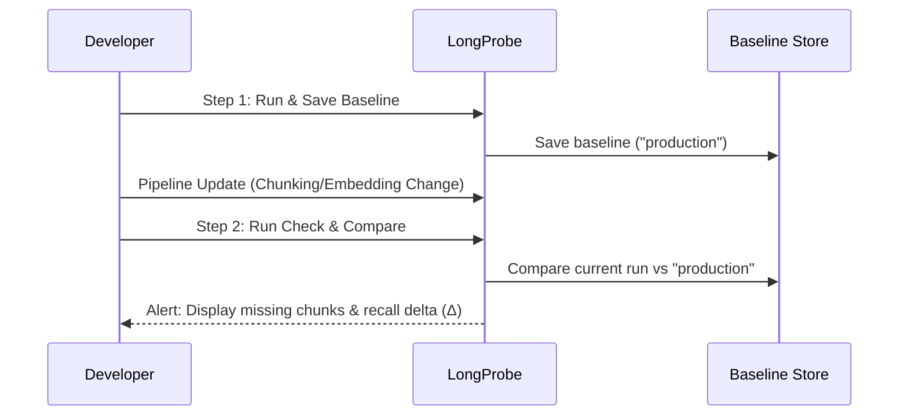

# Detect RAG Regressions Over Time

The **Detect Regressions** demonstration shows how to establish a baseline snapshot of your RAG pipeline and automatically detect retrieval regressions whenever chunking, embeddings, or documents change.

---

## Overview

A **retrieval regression** occurs when a modification to your RAG pipeline (such as changing `chunk_size`, updating vector database indexes, or removing documents) causes the vector store to fail to retrieve ground-truth chunks that previously succeeded.

LongProbe's baseline tracking allows you to save named baselines (e.g. `production-v1`), run tests after making changes, and generate detailed regression reports highlighting exact lost chunks.

---

## Running the Demo

To run the regression detection demo locally:

```bash
uv run python demo_run/detect_regressions.py
```

---

## Two-Step Baseline Comparison Workflow

The regression detection workflow consists of two core steps:



---

## Interactive TUI Output

When executed, LongProbe displays the baseline creation and comparison progress:

```text
📊 Baseline Tracking - Detect RAG Regressions

╭──────────────────────────────────────────────────────────────────────────────────────────────────╮
│ ✓ Setup complete                                                                                 │
│                                                                                                  │
│   STEP 1                       ✓                  Baseline established - Recall: 83.3%           │
│   STEP 2                       ✓                  Comparison complete - Recall: 83.3%            │
╰──────────────────────────────────────────────────────────────────────────────────────────────────╯

╭───────────────────────────────────── 📈 BASELINE COMPARISON ─────────────────────────────────────╮
│ ✓ No regressions detected                                                                        │
│                                                                                                  │
│ ➡️ Unchanged: 3 questions                                                                        │
╰──────────────────────────────────────────────────────────────────────────────────────────────────╯

✅ Safe to deploy - no regressions detected!
```

---

## Code Example: Saving & Comparing Baselines

```python
from longprobe import LongProbe
from longprobe.core.baseline import BaselineStore

# 1. Initialize LongProbe
probe = LongProbe(adapter=adapter, goldens_path="goldens.yaml")

# 2. Run initial check & save production baseline
initial_report = probe.run()
probe.save_baseline(label="production-v1")

# --- Developer updates RAG pipeline or re-indexes documents ---

# 3. Run check on updated pipeline
new_report = probe.run()

# 4. Compare current run against baseline
baseline_store = BaselineStore(db_path=".longprobe/baselines.db")
baseline_report = baseline_store.load("production-v1")

diff = baseline_store.diff(new_report, baseline_report)

# 5. Check for regressions
if diff.get("regressions"):
    print("⚠️ REGRESSIONS DETECTED!")
    for reg in diff["regressions"]:
        print(f"Question: {reg['question_id']}")
        print(f"Recall Drop: {reg['baseline_recall']:.1%} -> {reg['current_recall']:.1%}")
        print(f"Lost Chunks: {reg['lost_chunks']}")
else:
    print("✅ No regressions detected - safe to deploy!")
```

---

## Command Line Interface (CLI) Baseline Workflow

You can manage baselines directly from your terminal:

```bash
# Save baseline snapshot
uv run longprobe baseline save --label production-v1

# List all saved baselines
uv run longprobe baseline list

# Compare current pipeline against saved baseline
uv run longprobe baseline diff production-v1
```
